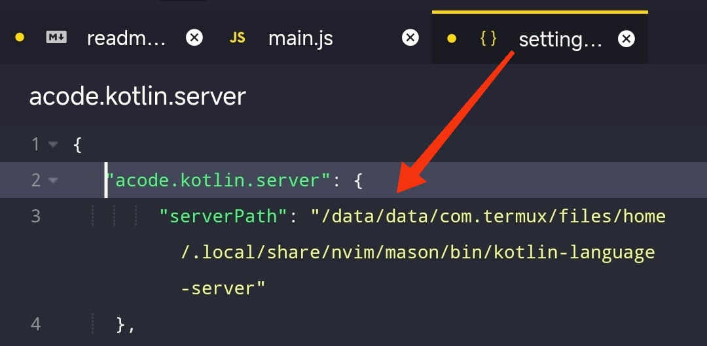

# Acode Kotlin Language Client

This a Experiment Kotlin Language Server on Acode
[Example Source Code](https://acode.app/plugin/acode.language.client)

## Acode Plugin Requiriment Installed

1. [Acode Language Client](https://acode.app/plugin/acode.language.client) for kotlin Autocomplete

## Setup

### Setup Language Server

- Download _server.zip_ in [kotlin-language-server](https://github.com/fwcd/kotlin-language-server) repository.

- Extract _server.zip_

- copy fullpath binary _kotlin-language-server_

- Goto settings > Edit Settings.json
  add this json and fullpath binary file of _kotlin-language-server_ on serverPath.
  or in a simple way you can click the gear button above

  Example:

  ```json
    "acode.kotlin.client": {
      "serverPath": "/data/data/com.termux/files/home/server/bin/kotlin-language-server"
  }
  ```

  
  if you not setting. this will take automatically Default serverPath/Default Settings
  is neovim Path bin language server
  _/data/data/com.termux/files/home/.local/share/nvim/mason/bin/kotlin-language-server_
